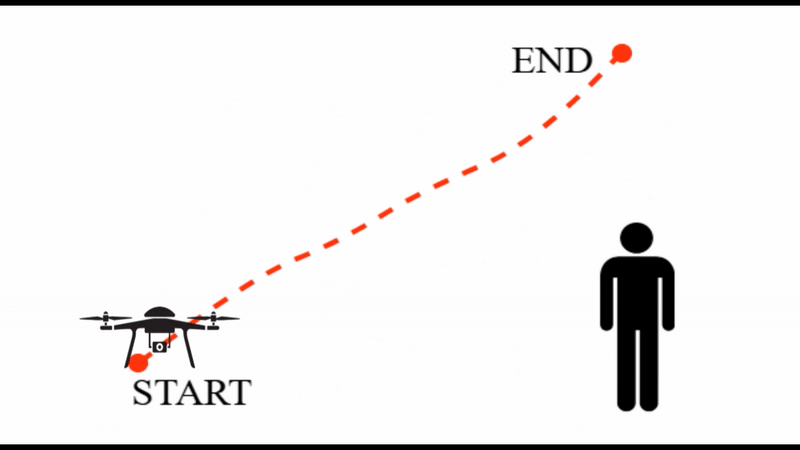

<div style="text-align: center;">

  <h1>OVITA: Open Vocabulary Interpretable Trajectory Adaptations</h1>
  <h2>Robotics and Automation Letters 2025</h2>

  <p>
    <a href="https://anurag1000101.github.io/" target="_blank"><strong>Anurag Maurya</strong></a> <sup>1</sup>
    ·
    <a href="#" target="_blank"><strong>Tashmoy Ghosh</strong></a> <sup>1</sup>
    ·
    <a href="https://www.csc.liv.ac.uk/~anguyen/" target="_blank"><strong>Anh Nguyen</strong></a> <sup>2</sup>
    ·
    <a href="https://ravipr009.github.io/" target="_blank"><strong>Ravi Prakash</strong></a> <sup>1</sup>
  </p>

  <p style="margin-top: 0;">
    <sup>1</sup> Human Interactive Robotics Lab, IISc Bangalore <br>
    <sup>2</sup> Department of Computer Science, University of Liverpool, UK
  </p>

  <p>
    <a href="https://anurag1000101.github.io/projects/IISC/">
      
    </a>
    <a href="https://anurag1000101.github.io/projects/IISC/">
      
    </a>
  </p>

</div>

<table style="width:100%; text-align:center;">
  <tr>
    <td>
      <br>
      Trajectory of a drone surveilling an area
    </td>
    <td>
      <br>
      Instruction: "Can you approach person closely and slowly?"
    </td>
  </tr>
</table>

---
## 📖 Abstract

Adapting trajectories to dynamic situations and user preferences is crucial for robot operation in unstructured environments with non-expert users. Natural language enables users to express these adjustments in an interactive manner. We introduce OVITA, an interpretable, open-vocabulary, language- driven framework designed for adapting robot trajectories in dynamic and novel situations based on human instructions. OVITA leverages multiple pre-trained Large Language Models (LLMs) to integrate user commands into trajectories generated by motion planners or those learned through demonstrations. OVITA employs code as an adaptation policy generated by an LLM, enabling users to adjust individual waypoints, thus providing flexible control. Another LLM, which acts as a code explainer, removes the need for expert users, enabling intuitive interactions. The efficacy and significance of the proposed OVITA framework is demonstrated through extensive simulations and real-world environments with diverse tasks involving spatiotemporal variations on heterogeneous robotic platforms such as a KUKA IIWA robot manipulator, Clearpath Jackal ground robot, and CrazyFlie drone.

---
## Installation

Pre-requisites:
- [miniconda](https://docs.conda.io/projects/miniconda/en/latest/index.html)

Clone this repository with
```bash
cd ~
git clone https://github.com/anurag1000101/OVITA.git
cd OVITA
conda env create -f environment.yaml
conda activate ovita
pip install -e .
```

---
## Running the agent

To try out the agent:

- Save your your API keys as environment variables:

	OPENAI_API_KEY = "your_openai_api_key"
	GEMINI_API_KEY = "your_gemini_api_key"
	CLAUDE_API_KEY = "your_claude_api_key"

- Run the agent with:

    ```bash
	python scripts/main.py --trajectory_path <path_to_trajectory> --save_dir <path_to_save_directory> --llm <openai|gemini|claude> --save_results <True|False> --robot_type <robot_name_or_None>
    ```

---
### Try in GUI

```bash
streamlit run ~/<Path to GUI File>/main_gui_streamlit.py
```
> **Steps to Adapt Trajectory:**
- Steps to Adapt Trajectory:
	1. Upload the trajectory file via the navigator.
	2. Inspect the original trajectory in the Plotly-rendered view.
	3. In the sidebar, enter adaptation instructions, choose the LLM, and set the robot type to LaTTe.
	4. Click Run Adaptation and wait for it to complete.
	5. Select Zero-Shot as the trajectory view and inspect the modified trajectory.
	6. If further adjustments are needed, provide feedback, select the context type, and click Run Adaptation.
	7. Select Final as the trajectory view. Repeat steps 6 and 7 until satisfied.
	8. Play around with the CSM configs to achieve best results. Have a look at the config.py file for more fine-graiend control over params.
	9. To reset to the initial modified results, press Reset. Repeat step 8 until satisfied.
	10. Once satisfied, browse for the respective directory and press Save to save the results.

📌 Using Your Own Trajectory:
Ensure your trajectory file is a **JSON file** with the following structure: 

```json
{
    "trajectory": [[x, y, z, speed], [x, y, z, speed], ...],
    "instruction": "your instruction here; can be given directly in the GUI too",
    "objects": [
        {
            "name": "person",
            "x": 1.0,
            "y": 0.11,
            "z": 0.8
        },
        ...
    ],
    "Env_descp": "Any environment description you want to give"
}
```

---
## Citation

If you use our work or code base(s), please cite our article:
```
@article{ovita2025,
  title={OVITA: Open Vocabulary Interpretable Trajectory Adaptations},
  author={Anurag Maurya and Tashmoy Ghosh and Anh Nguyen and Ravi Prakash},
  year={2025}
}
```

If you have any questions, reach out to -- [akmaurya7379@gmail.com](mailto:akmaurya7379@gmail.com)

